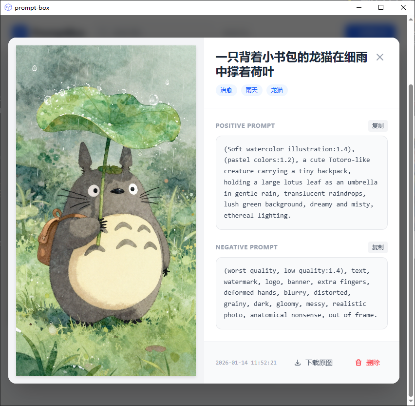
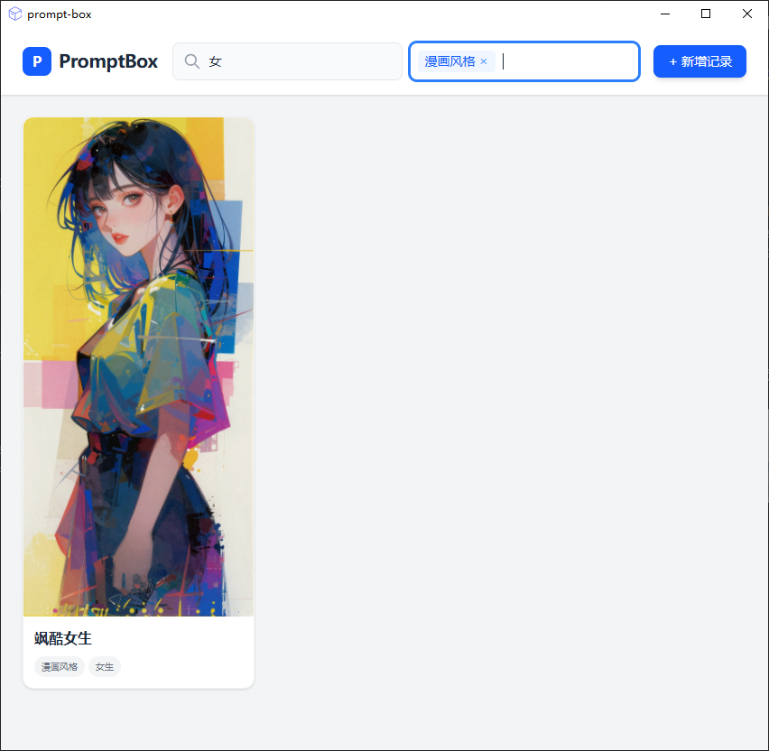

# 🎨 PromptBox 提示词助手

> 这里的灵感，过目不忘。
> 一款专为 AI 绘画爱好者设计的本地化提示词与图片管理工具，基于 Tauri v2 构建。


## ✨ 项目背景

PromptBox 旨在解决 AI 绘画（Stable Diffusion / Midjourney / ComfyUI）过程中，优秀的生成图与提示词（Prompts）容易丢失、难以整理的痛点。
它提供了一个私密、安全、高性能的本地管理方案，让你轻松建立个人的灵感库。

## 📸 界面预览

|                  瀑布流首页                  |                   详情与复制                   |                  标签组合搜索                   |
|:---------------------------------------:|:-----------------------------------------:|:-----------------------------------------:|
|  |  |  |

## 🚀 核心功能

* **🔒 本地化存储**：所有图片和数据存储在用户的 AppData 目录 (`%APPDATA%`)，无需联网，数据绝对安全。
* **🌊 高性能瀑布流**：基于 Macy.js 实现的自适应瀑布流布局，支持大量图片流畅加载。
* **🏷️ 智能标签系统**：
    * 支持标签**联想输入**与**回车创建**。
    * 底层采用 **SQLite 三表关联结构** (Prompts - Tags - Relations)，为海量数据检索提供高性能支持。
* **🔍 组合检索**：支持 **标题模糊搜索** + **标签精确筛选** 的组合查询模式。
* **📋 一键复用**：详情页支持一键复制正向/负向提示词，支持导出原图。
* **⚙️ 窗口记忆**：自动记忆窗口大小与位置，启动即居中，并限制最小尺寸防止布局崩坏。

## 🛠️ 技术栈

**Frontend (前端):**
* **Framework**: Vue 3 (Composition API) + TypeScript
* **Build Tool**: Vite
* **Styling**: Tailwind CSS v4 (CSS-first configuration)
* **Layout**: Macy.js (Waterfall grid)
* **Icons**: Heroicons (SVG)

**Backend (后端):**
* **Core**: Rust (Tauri v2)
* **Database**: SQLite (via `rusqlite` crate)
* **Plugins**:
    * `tauri-plugin-fs`: 文件系统操作
    * `tauri-plugin-dialog`: 原生文件选择框
    * `tauri-plugin-clipboard-manager`: 剪贴板操作

## 💻 本地开发指南

### 前置要求
* [Node.js](https://nodejs.org/) (v18+)
* [Rust](https://www.rust-lang.org/tools/install) (latest stable)
* Windows / macOS / Linux Build Tools (根据 Tauri 官方文档配置)

### 1. 克隆项目
```bash
git clone https://github.com/CIPFZ/prompt-box.git
cd prompt-box
```

### 2. 安装依赖
```bash
npm install
# 安装 Rust 依赖 (通常会自动执行，如未执行请手动运行)
cd src-tauri && cargo fetch
```

### 3. 启动开发环境
```bash
# 同时启动前端 HMR 和 Rust 后端
npm run tauri dev
```

### 4. 打包构建
```bash
# 构建生产环境安装包 (.exe / .dmg / .deb)
npm run tauri build
```

# 📅 Roadmap & TODO List

## ✅ 已完成 (Phase 1)

- [x] **基础设施**: Tauri v2 环境搭建，SQLite 数据库初始化
- [x] **图片录入**: 图片拷贝至 AppData，生成 UUID 防止冲突
- [x] **瀑布流展示**: 实现首页图片懒加载与自适应布局
- [x] **标签系统**: 实现标签的多选、新建、联想输入组件 (TagInput)
- [x] **数据库**: 使用 `prompts + tags + prompt_tags` 规范化结构
- [x] **详情交互**: 大图预览、提示词复制、记录删除（级联删除文件）
- [x] **导出功能**: 支持将原图另存为到指定目录
- [x] **组合搜索**: 实现标题 (Like) 与标签 (In) 的联合过滤

## 🚧 规划中 (Phase 2 - 优化体验)

- [ ] **性能优化**
    - [ ] 录入时生成 200px 缩略图，列表页仅加载缩略图以降低内存占用
    - [ ] 引入虚拟滚动 (Virtual Scroll) 以支持万级图片浏览

- [ ] **交互升级**
    - [ ] 支持拖拽上传 (Drag & Drop) 图片到主界面
    - [ ] 支持右键菜单（上下文菜单）进行快速编辑

- [ ] **系统设置**
    - [ ] 主题切换 (Light / Dark Mode)
    - [ ] 自定义数据存储路径（迁移数据文件夹）

## 🤝 贡献 (Contributing)

欢迎提交 Issue 或 Pull Request！

1. Fork 本仓库
2. 新建分支
   ```bash
   git checkout -b feature/AmazingFeature
   ```
   
3. 提交更改
    ```bash
    git commit -m "Add some AmazingFeature"
    ```

4. 推送到分支
    ```bash
    git push origin feature/AmazingFeature
    ```
5. 提交 Pull Request

## 📄 开源协议 (License)

Distributed under the **MIT License**.  
See `LICENSE` for more information.


